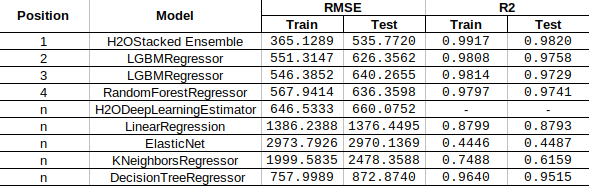

# Predicting diamond prices with supervised machine learning regression models-kaggle competition

This project is developed at the scope of Ironhack's Data Analytics Full-time Bootcamp.

## Resume

The aim of this project is to predict as best as possible the price of a dataset by means of supervised machine learning (ML) regression models in Python. 
The competition is released at https://www.kaggle.com/c/diamonds-datamad0820/overview, though it is a private challenge.

The evaluation metric chosen for this competition is the RMSE (Root Mean Squared Error): https://en.wikipedia.org/wiki/Root-mean-square_deviation

In this website, two .cvs files are attached:
1) The one containing the dataset for training the ML model. Its columns are:
    id: only for test & sample submission files, id for prediction sample identification

    price: price in USD

    carat: weight of the diamond

    cut: quality of the cut (Fair, Good, Very Good, Premium, Ideal)

    color: diamond colour, from J (worst) to D (best)

    clarity: a measurement of how clear the diamond is (I1 (worst), SI2, SI1, 
    VS2, VS1, VVS2, VVS1, IF (best))

    x: length in mm

    y: width in mm

    z: depth in mm

    depth: total depth percentage = z / mean(x, y) = 2 * z / (x + y) (43--79)

    table: width of top of diamond relative to widest point (43--95)

2) The one containing the dataset were the model must be applied in order to predict price. Its columns are the same as the previous one, except for the price.

## Structure

1) README.txt: As a resume for the content of the project an its development

2) src: This folder contains every model carried out. These are .ipynb files.
The 4 best fitting models are numbers in their namefile (01-H2OStacked Ensemble,02-LGBMRegressorV1,03-LGBMRegressorV2 and 04-RandomForestRegressorV5).
The other ones, are just tests that did not come to a submission to kaggle. (Linear Regressrion, ElasticNet, KNeighborsRegressor,  DecisionTreeRegressor, RandomForestRegressor with hyperparameters changing, H2ODeepLearningStimator)

3) pdf: It contains a final slide summming the developed project, and neeeded files for the readme file and the slide itself

## Project development

First of all, the analysis of the training dataset is carried out. The dataset itself is pretty clear, and does not contain null values or duplicated ones. Nevertheless, there are some columns (i.e. cut, color and clarity) that are categorical and must be transformed. On that purpose, the get_dummies function convert them into ordinal values, so that they can be easily classified as if they were integers. This way,  not only can we carry out a correlation matrix between every parameter, but we can also treat the whole dataset in our ML models.

At a first glance, it might seem as x,y,z were so tightly relationed to carat that taking them into account would not be worthy (even make our model becoming overfitted). However, they are also really closed-related to price, and further iterations will show that they do improve our model.

Spoiler alert: H2ODeepLearningEstimator illustrate it with no doubt. We cannot drop x,y,z columns in our models.

On the other hand, we got to sort the price values of every diamond, to get a better idea of their distribution along the dataset. The following graph show that it would make sense to distinguish between less/more expensive diamonds to train two different machine earning models. For the present project, this task was never done, but it might increase predictions' behaviour.

From here on, different supervised machine learning regression models are attempted (on a first checking with 80%-20% training-test dataset), also testing different hyperparameters to check models' sensitivity. Once a model is validated, we run it for the 100% of the data and predict the price of diamonds for the predict cvs mentiones above. 

For skelarn regression models, cross validation has been carried out with 10 folds, in order to improve the accuracy of our models.

Also H2O models have been attempted in this project.

## Conclusions
After trying several sklearn library models, all effort was worthless to improve RMSE. Luckily, other libraries as H2O are availaby on this purpose.

It is really significant to mention that H2O library, which works with Java but is algo Python-friendly :) , has its function AutoML, where we just specify how long we want to train for and out training dataset (200 seconds in this case). In that time, AutoML trains several models and compares different metrics to lead a ranking among every model.

At last, we can choose the leader model and run it by taking the 100% of the dataset. So as to make our predictions on diamonds price for the final submission.

The most relevant models' results after several iterations are summed up in the following table:

As we can see, it is clearly H2OStacked Ensemble Regression Model which best fits our data.

Now, we can just wait for the kaggle competition leaderboard!!!